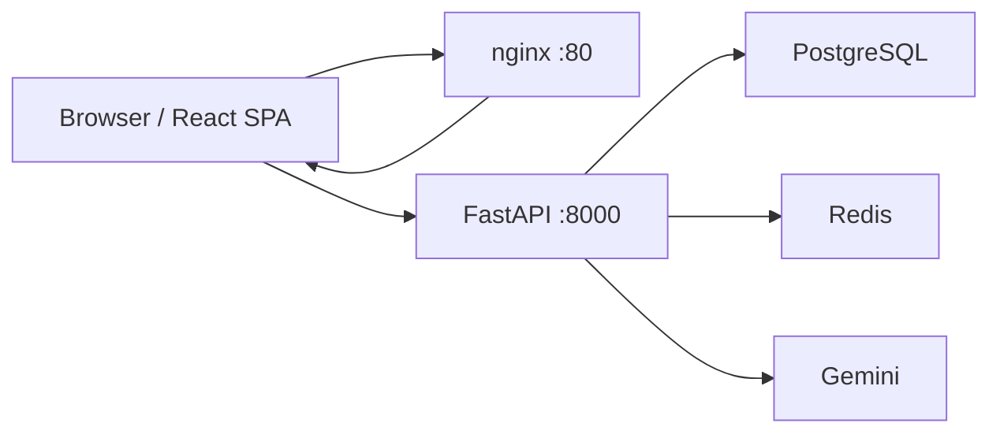
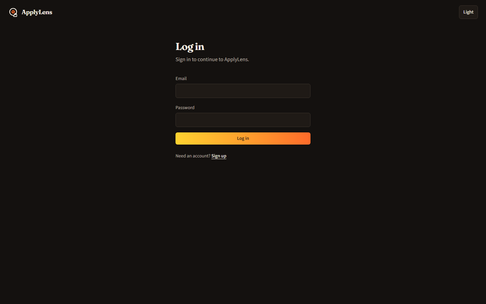
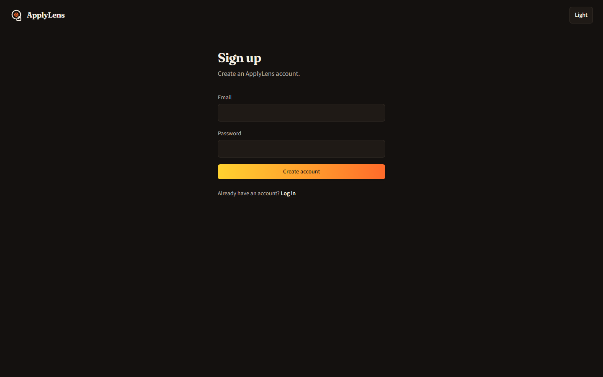
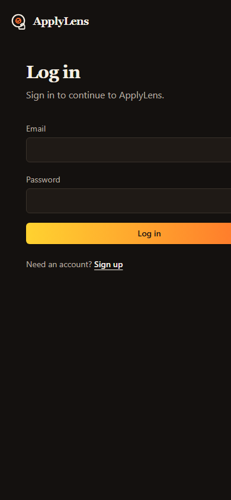

# ApplyLens

AI-powered job and internship application tracker. Track applications, review a resume against ATS-style criteria, compare keywords to a job description, and draft a cover letter — with the Gemini key staying on the server.

**Live demo (HTTP):** [http://13.203.208.130](http://13.203.208.130) · **API health:** [http://13.203.208.130:8000/health](http://13.203.208.130:8000/health)

Single EC2 host in `ap-south-1`. No TLS. The public IP can change if the instance is replaced without an Elastic IP.

```
React (Vite)
  ↓
FastAPI
  ↓
SQLAlchemy
  ↓
PostgreSQL
```

---

## Problem

Job search data is usually split across spreadsheets, email, and ad-hoc notes. ApplyLens keeps applications, interview rounds, and deadlines in one place, and runs three optional AI helpers (resume review, JD keyword match, cover-letter draft) without sending the provider key to the browser.

## Features

- Email/password signup and login (JWT access + refresh)
- Application CRUD with status, notes, job description, deadlines, search, and filters
- Interview rounds on each application
- Dashboard analytics (counts, response rate, upcoming deadlines; time-to-response is `null` because the schema has no response timestamp)
- Resume Analyzer: PDF upload → standalone ATS-style quality review
- JD Match: resume PDF + pasted job text → keyword overlap
- Cover letter: resume PDF + company/role/JD → draft to review before use
- Light and dark themes
- Per-user AI quota: 10 requests per hour (Redis counters)

Not included: scraping, email, notifications, social login, TLS, Kubernetes, or a job board.

## Architecture



One Docker Compose stack on one VM. The SPA is static files behind nginx. The browser calls FastAPI at `VITE_API_BASE_URL` (`http://<host>:8000`). PostgreSQL is the source of truth. Redis is not a cache layer and not a second database.

```
FastAPI
  ↓
Redis (AI rate-limit counters only)
```

## Tech stack

| Layer | Choice |
| --- | --- |
| Frontend | React, Vite, Tailwind CSS, React Router, Axios, Recharts |
| Backend | Python, FastAPI, Pydantic v2, SQLAlchemy 2 (async) |
| Database | PostgreSQL 16, Alembic |
| Auth | JWT (HS256), bcrypt |
| AI | `google-genai`, Gemini (`gemini-3.6-flash` by default), backend-only |
| Rate limits | Redis 7, ephemeral counters |
| Local/prod run | Docker Compose |
| CI | GitHub Actions (test + image build; no deploy) |
| Production host | AWS EC2 `t3.micro`, Ubuntu, `ap-south-1` |

## Database

Three tables: `users`, `applications`, `interview_rounds`. Integer primary keys. Status and interview outcome are string enums (`Wishlist`, `Applied`, `OA`, `Interviewing`, `Offer`, `Rejected`; `Pending`, `Passed`, `Failed`). Deletes cascade from user → applications → rounds. Resumes and AI outputs are not stored.

## API

Base: `/api/v1`. `GET /health` is unauthenticated and does not query Postgres.

| Area | Methods |
| --- | --- |
| Auth | `POST /auth/signup`, `/auth/login`, `/auth/refresh`, `GET /auth/me` |
| Applications | `GET/POST /applications`, `GET/PUT/DELETE /applications/{id}` |
| Interviews | `GET/POST /applications/{id}/interviews`, `PUT/DELETE .../interviews/{id}` |
| Analytics | `GET /analytics/summary` |
| AI | `POST /ai/resume-analysis`, `/ai/jd-match`, `/ai/cover-letter` (auth + quota) |

Ownership is enforced in SQL (`user_id`). Other users' IDs return `404`, not `403`.

## AI architecture

```
React
  ↓
FastAPI AI endpoint
  ↓
AIClient abstraction
  ↓
Gemini
```

React never calls Gemini. `AI_API_KEY` is a backend secret. PDFs are parsed in memory (PyMuPDF) and discarded. Prompts tell the model not to invent employment history or claim a specific company's ATS. Automated tests use a fake client; CI does not call Gemini.

## Redis

Redis holds keys of the form `ratelimit:ai:{user_id}:{window}` with a TTL for the rest of the hour. Persistence is disabled (no RDB/AOF). If Redis is down, the limiter **fails open** (the AI request still runs; the failure is logged). That is cost-control, not a security boundary.

## Local setup

### Backend

```powershell
cd backend
python -m venv .venv
.\.venv\Scripts\Activate.ps1
pip install -r requirements.txt
copy .env.example .env
alembic upgrade head
uvicorn app.main:app --reload
```

Health: `http://localhost:8000/health`

PostgreSQL must be running for the API (not for `GET /health` or the default pytest suite).

### Frontend

```powershell
cd frontend
copy .env.example .env
npm install
npm run dev
```

App: `http://localhost:5173`

### Docker (local)

Postgres and Redis are not published. Frontend is `http://localhost:8080`; API is `http://localhost:8000`. Redis is ephemeral.

```powershell
copy .env.example .env
docker compose up -d --build
```

`docker compose down -v` deletes the Postgres volume. Put `AI_API_KEY` only in the gitignored root `.env`, never in `VITE_*` files.

## Production deployment

Production file: `docker-compose.prod.yml` on one EC2 instance.

| Published | Not published |
| --- | --- |
| `80` nginx, `8000` FastAPI | Postgres `5432`, Redis `6379`, Docker daemon |

Containers use `restart: unless-stopped` and `no-new-privileges`. Secrets come from a gitignored `.env` on the host (from `.env.production.example`). Images do not copy `.env`. `ENVIRONMENT=production` rejects the development JWT default and secrets shorter than 32 characters.

```bash
cp .env.production.example .env
# set JWT_SECRET, POSTGRES_PASSWORD, VITE_API_BASE_URL, CORS_ORIGINS, optional AI_API_KEY
docker compose --env-file .env -f docker-compose.prod.yml up -d --build
```

`VITE_API_BASE_URL` must be `http://<public-ip>:8000`. `CORS_ORIGINS` must be `http://<public-ip>` (no `:80`). Changing the public IP requires a frontend image rebuild.

Full AWS console, SSH, and operations steps: [`docs/aws-ec2-deployment.md`](docs/aws-ec2-deployment.md). Live checks from Stage 19: [`docs/stage-19-verification.md`](docs/stage-19-verification.md).

## Security considerations

- Passwords hashed with bcrypt; JWTs signed with `JWT_SECRET`
- Access token ~15 minutes, kept in memory on the client; refresh token in `localStorage` (XSS tradeoff; not httpOnly cookies)
- CORS allowlist; AI key never in the frontend bundle
- Production Compose does not publish Postgres or Redis
- nginx: `server_tokens off`, `X-Content-Type-Options`, `X-Frame-Options`, `Referrer-Policy`
- Rate limit is per authenticated user, not a global DDoS shield
- **HTTP only** — tokens and form bodies are not encrypted in transit on the current demo host

## Testing

| Suite | Command | Notes |
| --- | --- | --- |
| Backend | `cd backend && pytest` | In-memory SQLite, fake AI, fake Redis |
| Frontend | `cd frontend && npm test` | Vitest |
| Frontend build | `cd frontend && npm run build` | Production bundle |
| Compose sanity | pytest `test_production_compose.py` | Unpublished DB/Redis, restart policy |
| Live host | `python scripts/verify_production.py --host <ip>` | Optional; not run by CI |

GitHub Actions on `main` / PRs: pytest, Vitest, Vite build, `docker compose config` (local + prod), `docker compose build`. CI does not deploy and does not use AWS or Gemini credentials.

## Environment variables

**Backend / Compose:** `DATABASE_URL`, `REDIS_URL`, `CORS_ORIGINS`, `JWT_SECRET`, `AI_API_KEY` (optional), `AI_PROVIDER`, `AI_MODEL`, rate-limit settings. Production also requires `POSTGRES_*` and a unique `JWT_SECRET`.

**Frontend (build-time, public):** `VITE_API_BASE_URL` only.

Templates: `backend/.env.example`, `frontend/.env.example`, `.env.example` (local Compose), `.env.production.example` (EC2). Never commit filled `.env` files or PEM keys.

## Screenshots

Captured from the live demo (`http://13.203.208.130`) in dark mode.

**Login (desktop)**



**Sign up (desktop)**



**Login (narrow viewport)**



Authenticated dashboard, application list, and AI forms require a logged-in session; they follow the same chrome and orange accent as these guest screens.

## Known limitations

- HTTP, no load balancer, no TLS
- FastAPI is publicly reachable on port 8000 because the SPA calls it directly
- Single instance; Postgres is on the instance volume
- Redis has no password; it is reachable only on the Compose network
- Rate limiter can burst at window edges and fails open if Redis is down
- Refresh tokens cannot be revoked except by expiry or secret rotation
- `average_time_to_response_days` is always `null`
- Cover letters and scores are model drafts, not guarantees
- `t3.micro` may need swap to build the frontend image
- Demo IP `13.203.208.130` is the host verified in Stage 19; it is not a permanent hostname

## Future improvements

- HTTPS (reverse proxy or ALB + certificate)
- httpOnly cookie auth
- Postgres backups / snapshots
- Redis AUTH on the private network
- Token revocation or a session table
- Response-date field if time-to-response is needed
- Do not add Kubernetes, microservices, or a message queue unless the product actually needs them

## Documentation

- [`BUILD_SPEC.md`](BUILD_SPEC.md) — staged build specification
- [`DECISIONS.md`](DECISIONS.md) — architectural decisions
- [`docs/aws-ec2-deployment.md`](docs/aws-ec2-deployment.md) — EC2 operations
- [`docs/stage-19-verification.md`](docs/stage-19-verification.md) — production verification record
- [`backend/README.md`](backend/README.md) — API setup
- [`frontend/README.md`](frontend/README.md) — client setup
